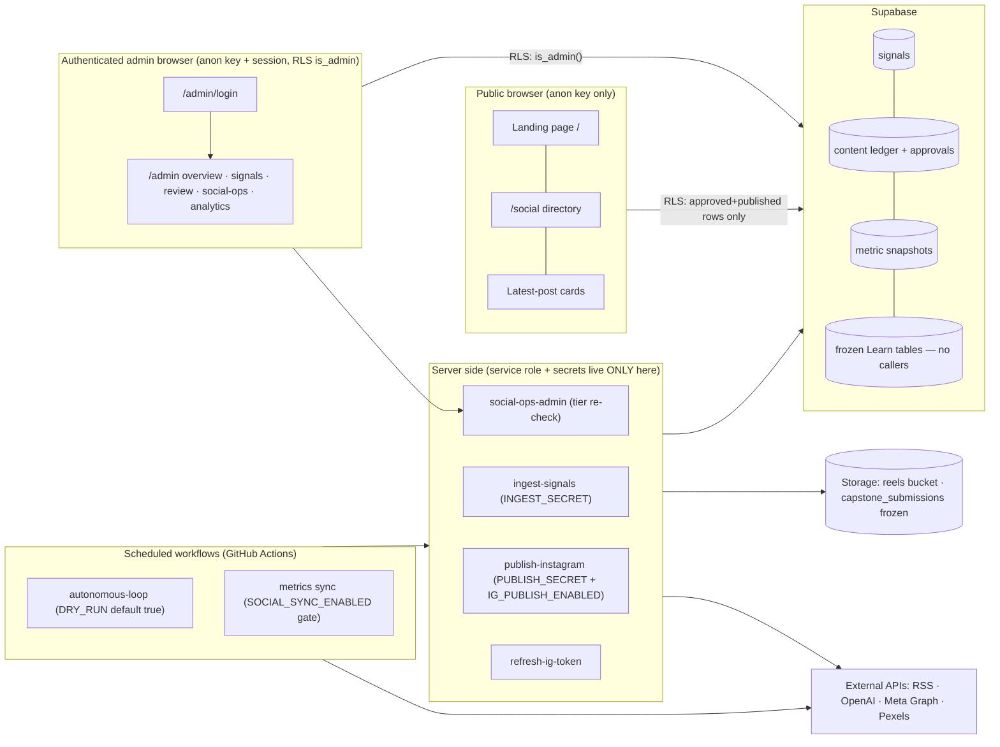

# Jifunze.ai — Final Implementation Plan for the Instagram-First Pivot

**Date:** 2026-08-21 · **Status:** Plan only — nothing was modified, committed, pushed, deployed, migrated, or enabled in producing this document.
**Evidence base:** the three completed audits (Learn boundary inventory · engine capability assessment · website/branding/admin assessment) plus fresh read-only verification of both the remote clone and the local working copy.

---

## 1. Executive verdict

The pivot is achievable in six small PRs with no destructive operation anywhere in the sequence. The audits establish that the social engine is fully decoupled from Learn (orchestrator + renderer import only 7 files from `src/`, all in `src/social/`), that removal requires **zero npm dependency changes**, and that exactly seven shared-code traps stand between a naive deletion and a broken console — all seven are cheap to defuse in advance.

Two things changed during the final verification pass, because the owner ran commands in Terminal while this plan was being produced:

1. **The freeze gate is now cleared and remotely verified.** Annotated tag `jifunze-learn-frozen-2026-08-21` (tag object `e4bbcf8`, pointing to commit `78062b1`) and branch `archive/jifunze-learn` (at `78062b1`) both exist on `origin` — confirmed independently via `git ls-remote` from a separate clone, not from the push output alone. The owner's own `grep` verification step failed only because a pasted `#` comment became a grep argument; the refs are real.
2. **The earlier uncommitted work was partially discarded by the owner's paste** — see the warning below. Its tracked portion now exists only as `~/Desktop/jifunze-wip-2026-08-21.patch`, which this session cannot reach or verify. Securing and verifying that patch is now the first action of PR 1.

The remaining blockers are procedural: this session still cannot push (git proxy 403 — repo not yet in the authorized source set), the Desktop patch is unverified, and four decisions need the owner (§14). One prior finding is unchanged and governs everything about the old work: **the earlier WIP was NOT Learn removal — it was a retired-SaaS cleanup that deleted at least ten files the audits classify as Preserve or Refactor-first.** It must be kept separate and compared, never silently included.

## 2. Repository-state warning

State was verified read-only twice on 2026-08-21: **before** the owner's Terminal session (rows marked *pre*) and **after** it (rows marked *now*). Nothing was written by this session at any point.

| # | Fact | Value |
|---|---|---|
| 1 | Exact `origin/main` SHA | `78062b19944a5ade5d1c6fae5557f77204f3fcee` — "Merge pull request #4 … chore/harden-autonomous-content-loop" |
| 2 | Local `HEAD` SHA | *pre:* `14b183e2835e24042259a7b2048a0966e915aebd` · *now:* `78062b19944a5ade5d1c6fae5557f77204f3fcee` |
| 3 | Local branch | *pre:* `chore/harden-autonomous-content-loop` · *now:* `main` |
| 4 | Ahead/behind | *pre:* 0 ahead / 1 behind `origin/main` (only the PR #4 merge commit; local HEAD was its second parent — no unique remote content was absent) · *now:* level with `origin/main` |
| 5 | Tracked modifications | *pre:* **25 files** (`src/access` 2, `src/auth/AuthContext.tsx`, `src/components` 8 — incl. Learn pages, `DashboardPage`, `AdminCapstonesReviewPage` — `src/hooks` 4, `src/lib` 4, `src/training` 2, `src/learning` 1, `src/data/teaching` 1, `docs/persistence-supabase.md`, `supabase/.temp/cli-latest`) · *now:* **0 — discarded from the working tree** (see warning) |
| 6 | Tracked deletions | *pre:* **236 files** (`src/` 158: `services` 91, `types` 32, `config` 17, `persistence` 8, `components` 7, `trends` 4, `lib` 4, 1 each `auth`/`workspace`/`contracts`/`constants`; `docs/` 42 course docs; `How to use Claude/` 36) · *now:* **0 — restored to tracked state** (see warning) |
| 7 | Untracked files | **16 paths — all survived** (`git clean -fd` never executed; zsh aborted that word on the pasted comment's parenthesis). Notable: `jifunze-brand-refresh.bundle` — a git bundle holding branch `feat/jifunze-brand-refresh` @ `83029f0`, **a commit that exists in no local or remote ref**; `docs/JIFUNZE_MASTER_PLAN.md` — referenced by the tracked README but **not tracked at `origin/main`; it exists only as this local file**; `_quarantined_migrations/`, `src/data/learning/courses/`, `src/services/learnerState/`, `CLAUDE.md`, `decision.json`, six `docs/internal/` wave reports, `docs/social/PLAN_PR_CI_AND_WORKFLOW_HARDENING.md`, `docs/PREFLIGHT_2026-08-21.md` |
| 8 | Overlap with the audited Learn boundary | **Minimal and conflicting.** The deletions targeted the *retired-SaaS* subsystem (`src/services`, `src/types`, `src/config`, `src/persistence`, `src/trends`) and course *documentation* — not the Learn application code (no `src/components/learn/`, `src/data/learning/`, or `public/course-assets/` deletions). Critically, the WIP **deleted files the audits classify as Preserve/Refactor-first**: `src/auth/bootstrapTenant.ts` (imported by the kept `AuthContext`), `src/config/demoBrands.ts` + `demoSocialAccounts.ts` (2 of the 3 kept config files), all of `src/persistence/` (shared via the kept type graph), and kept types incl. `src/types/brand.ts` and `src/types/content.ts`. The 25 modifications (AuthContext, access, Learn pages) indicate an uncommitted, unverified deeper refactor detaching the tenant/persistence layer. **It must be preserved separately (§11) and compared — never silently included in any pivot PR.** |

### ⚠ What actually happened in the owner's Terminal session (reconstructed from the pasted output)

The owner pasted command blocks *including their `#` comment lines*, and zsh treated those comments as arguments, so the blocks executed **partially**:

- `rm -f .git/HEAD.lock .git/index.lock` — ran; the stuck locks are gone.
- `git diff > ~/Desktop/jifunze-wip-2026-08-21.patch` — ran **before** anything was discarded. Because all 236 deletions and 25 modifications were unstaged, plain `git diff` captured **all of them**. This Desktop file is now the **only copy of the tracked WIP**.
- `git checkout -- .` — **ran**, discarding the tracked modifications and restoring the deleted tracked files.
- `git clean -fd  # discard WIP (removal…)` — **did not run**: zsh raised `unknown file attribute` on the comment's parenthesis and aborted that command word, so **every untracked file survived** (this is why the brand-refresh bundle and the master plan are still on disk).
- `git checkout main && git pull` — ran; local `main` fast-forwarded `7b9868d → 78062b1`.
- Tag + archive branch creation and push — ran and succeeded; verified remotely by this session via `git ls-remote`.

**Unverified and now critical:** `~/Desktop/jifunze-wip-2026-08-21.patch` is outside the connected folder, so this session cannot confirm it exists, its size, or that it applies cleanly. Until it is copied into the repo folder and verified (§11 step 1), the tracked WIP must be treated as at-risk. Also note `.env` exists locally and is ignored (commit `6e4bd2b`); no preservation step may ever `git add --force` it — §11 includes an explicit guard. No secret values were read or printed in producing this plan.

---

## 3. Removal decision matrix

Classifications: **Delete** (exclusively Learn, removable) · **Preserve** (required by engine/admin/public site) · **Refactor first** (shared) · **Archive only** (needed only for Learn restoration) · **Investigate** (uncertain). Risk = risk of removing/handling wrongly. PR numbers refer to §10.

### Application code (`src/`)

| Path | Class | Reason | Dependencies | Required action | Test coverage | Risk | PR |
|---|---|---|---|---|---|---|---|
| `src/components/learn/` (56) | Delete | Course pages, players, checkout | Imports Learn libs/data only | Delete with routes | 20 Learn e2e specs (deleted with it) | Low | 2 |
| `src/components/learner-shell/` (16) | Delete | Learner app shell/nav | Learn-only | Delete | e2e (deleted) | Low | 2 |
| `src/components/libraries/` (11) | Delete | Public course libraries | Learn data | Delete with `/library/*` routes | e2e (deleted) | Low | 2 |
| `src/components/admin/` (17) | Delete | Frozen 13-page Learn admin + capstone review + `RequireAdminAccess` | `adminAccess.ts` (kept) | Delete; new admin shell in PR 4 | `test-admin-health` (deleted) | Med | 2/4 |
| `src/components/training/`, `pathways/`, `teaching/`, `learning/`, `courses/` (19) | Delete | Learner practice/pathway UI | Learn-only | Delete | e2e (deleted) | Low | 2 |
| `src/components/pricing/`, `subscription/`, `workspace/`, `reports/`, `landing/`, `routing/`, `visuals/`, `access/RequireAccess.tsx` (~10) | Delete | Pricing/subscription/learner surfaces | Billing libs | Delete with `/pricing`, `/settings/subscription` | billing e2e (deleted) | Low | 2 |
| 12 root `src/components/*.tsx` (Dashboard*, PublicPricingPage, etc.) | Delete | Learner dashboard & retired panels | Learn-only | Delete | — | Low | 2 |
| `src/components/auth/AuthSignUpPage.tsx` + signup mode of `AuthForm` | Delete | **Public registration must not exist** | `AuthForm` shared with sign-in | Remove signup route + mode; keep sign-in | `career-skills-site.spec` extended | Med | 2 |
| `src/data/learning/`, `data/courses/`, `data/teaching/`, `data/publicStarterLibraries/` (121 files, ~3.3 MB) | Delete | Course content compiled into bundle | **One inbound edge**: `FullDisclaimerPage` imports one string | Break the edge (PR 1), then delete | `test:content-engine` unaffected | Low after PR 1 | 2 |
| `src/training/` (36+7) **except `trustCopy.ts`** | Delete | Training engines/plans | `trustCopy.ts` exports `LEGAL_ROUTES` used by 30+ kept files | Extract `LEGAL_ROUTES` first (PR 1) | social-ops suite asserts routes | **High if botched** | 1→2 |
| `src/knowledge/`, `src/services/learning/`, `src/services/teaching/` (39) | Delete | Course pipelines | Learn-only | Delete | — | Low | 2 |
| `src/hooks/` (all 8) | Delete | All are course-progress hooks | Learn-only | Delete directory | — | Low | 2 |
| `src/lib/` — 56 course modules incl. `billing*` | Delete | Flagship/math/billing/learner libs | `signedInDefaultRoute.ts` is the trap (below) | Delete after PR 1 rewrites the trap | — | Med | 2 |
| `src/lib/admin/` — 7 of 8 | Delete | Course health/inventory | Keep `adminAccess.ts` | Surgical delete, not `rm -rf` | social-ops suite | Med | 2 |
| `src/learner/` — 7 of 8 | Delete | Commerce/entitlements | `learnerCommerceConstants.ts` flag imported by kept footer + `App.tsx` | Inline flag first (PR 1) | — | Med | 1→2 |
| `src/learning/`, `src/subscription/` (5) | Delete | Entitlement + SKU registry | Pricing UI (deleted together) | Delete | — | Low | 2 |
| `src/auth/useDisclaimerAcknowledgment.ts` + `DisclaimerAcknowledgmentModal` | Delete | Learner-only gate | Wraps admin chain too — unwrap in App.tsx rewrite | Delete with route rewrite | — | Low | 2 |
| `src/services/{autonomy,content,signals,publishing,platforms,conversion,creative,lifecycle,opportunities,pipeline,mediaPlanning,simulation,trends,domains}` (~59) + `src/trends/` + 15 of 18 `src/config/` | **Delete — separate boundary** | Retired multi-tenant SaaS orphans, not Learn; unreachable from kept entry points | None inbound (audit-verified) | Delete, labeled "retired SaaS" in the PR, **cross-checked against the WIP snapshot** (§11) | none exists | Med | 2 |
| `src/social/` (7), `src/components/media/`, `src/components/social-ops/`, `src/services/socialOps/` | Preserve | The product: website + console + engine interface | Engine imports 7 of these files | No change in PRs 1–2 | 38 + 103 offline tests | — | — |
| `src/access/` (6 files), `src/auth/` (4 of 5), `src/lib/{supabaseClient,safeSupabaseWrite,jifunzeTelemetry,envCheck,maintenanceMode,safeReturnUrl}.ts`, `src/lib/admin/adminAccess.ts`, `src/profile/` (4 of 5), `src/components/{NotFoundPage,PublicSocialLinks,TrustLegalFooterLinks,TrustBoundaryStrip,AuthForm,brand/JifunzeBrandLogo}.tsx`, `src/config/supabaseEnv.ts` | Preserve | Auth, tiering, guards, shared UI used by console + site | Social-ops guard chain | Keep; `JifunzeBrandLogo` is rebuilt (not removed) in PR 3 | social-ops suite (guard, no-bypass, import-boundary tests) | — | — |
| `src/components/legal/` | Refactor first | Pages stay; content/chrome are old-platform | `PolicyChrome`/`LegalPageShell` use old logo; `FullDisclaimerPage` imports course data | PR 1 breaks the data import; PR 3 rebrands; delete unrouted `RefundsPolicyPage.tsx` | e2e site spec | Low | 1/3 |
| `src/training/trustCopy.ts` | **Refactor first** | Exports `LEGAL_ROUTES` + `SUPPORT_CONTACT_EMAIL` | 30+ kept importers incl. social-ops guard | Move to `src/shared/legalRoutes.ts`; update importers; then `src/training/` becomes Delete | social-ops suite | High | 1 |
| `src/lib/signedInDefaultRoute.ts` | Refactor first | Hardcodes `/dashboard` + Learn allowlist | `AuthSignInPage`, `App.tsx` | Rewrite: admin → `/admin`, else `/` | add unit assertion | Med | 1 |
| `src/index.css` | Refactor first | One global stylesheet; `.jf-media` is the brand, `:root` Learn tokens + orange `.jf-learn-warm` are legacy | Everything | Prune Learn/orange scopes in PR 3 (visual QA — failures are silent) | screenshots | Med | 3 |
| `src/App.tsx` | Refactor first | 467-line router mixing all products | All routes | Rewrite in PR 2 per §4 matrix | e2e retired-route specs | High | 2 |
| `src/persistence/` (7 + queries), `src/services/relevance/` (4 of 5), `src/types/` (29 of 33 audited-kept) | **Investigate** | Audit: shared via kept type graph (`AuthContext` persistence backends). **The WIP deleted all of it** — an unverified competing refactor | `AuthContext`, `bootstrapTenant`, kept types | Keep in PR 2 (audit verdict governs). Evaluate the WIP's detach refactor later as its own reviewed PR | none directly | Med | 2 (keep) / later |
| `src/types/teaching.ts`, `src/contracts/`, `src/constants/` | Investigate | Type-graph reachability uncertain | `tsc -b` decides | Delete only if build proves unreachable | typecheck | Low | 2 |
| `CLAUDE.md` (tracked, 0 bytes; a different untracked one exists locally) | Investigate | Ownership unclear | — | Leave both; owner decides | — | Low | — |

### Outside `src/`

| Path | Class | Reason | Required action | Risk | PR |
|---|---|---|---|---|---|
| `public/course-assets/` (**148 MB**), `public/training/` | Delete (archive keeps them) | Hosted course bundles shipped to Vercel | Delete after tag/branch verified; edit `vercel.json` regex in same PR | Low | 2 |
| `training/` (75), `training-imports/` (7), `content/` course schema+templates | Delete | Authoring sources, active app never reads them | Delete | Low | 2 |
| `scripts/` ~50 course scripts; `package.json` ~40 course npm scripts; `e2e/` 20 specs + 3 helpers; `playwright.billing-mock.config.ts`, `playwright.forced.config.ts` | Delete | Course verify/author/test tooling | Delete; rewrite `workspace-guest.spec.ts` + `public.spec.ts` (mixed specs) | Low | 2 |
| `scripts/uat*`, `guardUatSupabaseTarget.ts`, `supabase/tests/local_preamble.sql` | Investigate | Supabase-generic but exercise learning tables | Edit to target kept schema or defer | Low | 2/4 |
| `supabase/functions/stripe-{checkout,portal,webhook}` | **Archive only** | Course payments; must not deploy again | Remove from active branch + never deploy; webhook disabled at Stripe (owner, §5) | Med | 2 |
| `supabase/functions/{ingest-signals,publish-instagram,refresh-ig-token,social-ops-admin}` | Preserve | The engine's server side | No change; deploys stay separately authorized | — | — |
| `_quarantined_functions/` (4 tracked files) | Archive only | Retired SaaS functions, already remotely deleted per Amendment 002 | Delete from active branch in PR 2 | Low | 2 |
| 53 `supabase/migrations/*.sql` | **Preserve unchanged (files)** | Applied migrations are never edited or deleted — replay integrity; semantic ownership recorded in §5 | Keep every file on the active branch; PR 2 only removes *callers* | High if violated | — |
| `docs/` course docs (~20 top-level + curriculum dirs) | Archive only | Course documentation | Move-to-archive semantics: delete from active branch in PR 2 after tag verified; superseded governance docs (`PROJECT_CONTEXT.md`, `docs/JIFUNZE_MASTER_PLAN.md` once committed) **stay per Amendment 002 §4** with banners | Low | 2 |
| `brand/` (spec + logo/icon/favicon/fonts), `Jifunze Brand Logo Kit/` (21 files, verified) | Preserve | Approved brand source | Wire into `public/` + components in PR 3 | — | 3 |
| `brand-assets/` (21 superseded grey/blue files), `src/assets/branding/jifunze-logo-*.png` (old ".AI" + "Create smarter, Grow faster." baked in), `public/favicon.svg` (lightning bolt) | Delete from active use | Retired branding still shipping on 404/legal/auth | Remove/replace in PR 3; history + archive branch retain them | Low | 3 |
| `orchestrator/`, `render/`, `.github/workflows/` (3), `vercel.json`, `index.html` | Preserve / Refactor first | Engine, CI, hosting | `vercel.json` + `index.html` edited in PRs 2–3 | — | 2/3 |
| Untracked local: `jifunze-brand-refresh.bundle`, `docs/JIFUNZE_MASTER_PLAN.md`, `docs/internal/*` wave reports, `_quarantined_migrations/`, `src/services/learnerState/`, `src/data/learning/courses/`, `decision.json` | **Preserve via §11 snapshot** | Exist nowhere else; the bundle holds an unmerged branch (`feat/jifunze-brand-refresh` @ `83029f0`) | Snapshot before any other work; evaluate bundle contents for PR 3 reuse | **High if lost** | 1 |

Nothing classified Investigate is treated as safe to delete; each has a named resolution mechanism (type-check proof, owner decision, or deferred reviewed PR).
---

## 4. Route transition matrix

Every route family in `src/App.tsx` (the single router). "410/404 (edge)" means the HTTP status is emitted by Vercel routing config or a tiny edge handler introduced in PR 2/3 — the audits confirmed a pure SPA on the current one-rewrite `vercel.json` can only ever return 200, so intentional statuses are a hosting-config change, not a component change. Auth column: `—` public · `admin` authenticated + server-verified admin tier.

| Current route(s) | Component | Purpose | Target state | New destination / status | HTTP | Auth | PR |
|---|---|---|---|---|---|---|---|
| `/` | `HomeEntryPage` → `MediaHomePage`; signed-in users redirected to `/dashboard` or `/admin/dashboard` | Landing (with Learn redirect logic) | **Keep, rebuilt** | New branded landing per brief §12; signed-in redirect goes admin→`/admin`, else stays on `/` | 200 | — | 2 (redirect fix) / 3 (rebuild) |
| `/content`, `/content/:slug`, `/topics/:pillarSlug`, `/social`, `/about` | media pages | Content hub, pillar pages, directory, how-it-works | Keep | Refresh copy/pillars in PR 3 | 200 | — | 3 |
| `/privacy`, `/terms` | legal pages | Legal | Keep, rebrand + rewrite copy for the media brand | Same paths | 200 | — | 3 |
| `/disclaimer`, `/support`, `/refunds` | legal pages | Old-platform legal | Consolidate: `/contact` stays; `/refunds` retire (course refund policy) → 410; `/disclaimer` fold into `/terms` or keep simplified | per decision | 200/410 | — | 3 |
| `/contact` | `LearnerContactPage` | Contact | Keep, rebrand; fix contact email exposure decision (currently prints the Gmail address, not `hello@jifunze.ai`) | Same path | 200 | — | 3 |
| — (new) | — | AI & editorial transparency | **Add `/ai-disclosure`** | New page + sitemap entry + footer link | 200 | — | 3 |
| `/auth/sign-in`, `/forgot-password`, `/reset-password` | auth pages | Shared sign-in | Keep as the credential backend; **add `/admin/login`** as the labeled admin entry (either alias rendering the same secured form with "Administrator access" copy, or redirect target of choice) | `/admin/login` | 200 | — (form) | 4 |
| `/auth/sign-up` (+ legacy `?auth=signup`, `?signup=1` deep links) | `AuthSignUpPage` | **Open public registration** | **Remove** | 410; deep-link params ignored | 410 (edge) | — | 2 |
| `/learn`, `/learn/school/:id`, `/learn/category/:slug`, `/learn/free/*` (4 + 6 legacy redirects), `/learn/courses/:slug[/session/:id|/capstone]`, `/learn/:slug` standalone (+ certificate/modules/quiz/lessons), `/learn/readiness/:slug`, `/courses/*` legacy | ~45 Learn declarations | Course catalog & players | **Remove** | Branded retired-route page: "Jifunze's course experience is currently unavailable while we focus on practical social learning content." No previews, prices, or return dates | **410 (edge)** | — | 2 |
| `/learn/checkout` | `LearnerCheckoutPage` | Course payments | Remove | Same retired response | 410 (edge) | — | 2 |
| `/library/*`, `/libraries/*` (4 named + 5 extended configs + 4 standalone triples) | library pages | Public course libraries | Remove | Retired response | 410 (edge) | — | 2 |
| `/paths`, `/paths/:slug` | pathway pages | Learning pathways | Remove | Retired response | 410 (edge) | — | 2 |
| `/pricing`, `/settings/subscription` | pricing/subscription pages | Course pricing & billing | Remove | 410 | 410 (edge) | — | 2 |
| `/dashboard`, `/my-learning`, `/reports`, `/account`, `/settings`, `/learning/labs`, `/lab` | learner shell | Learner workspace | Remove | 404 (learner accounts are not a public concept anymore) | 404 (edge) | — | 2 |
| `/admin` → `/admin/dashboard`, `/admin/{learners,courses,enrollments,progress,certificates,reports,support,settings,health,capstones,learners/:userId,courses/:slug}` | `AdminShell` + 13 Learn-admin pages | Frozen Learn admin | **Remove pages; reclaim the `/admin` prefix** | `/admin` becomes the new admin overview (PR 4); Learn-admin sub-routes → 404 | 404 then 200-behind-auth | admin | 2 → 4 |
| `/admin/social-ops`, `/accounts`, `/pipeline`, `/safety` | social-ops console | Verified read-only ops console | **Preserve**, re-homed inside the new admin shell (paths may stay or move under `/admin/*`) | Same functionality, new nav | 200 behind auth | admin | 4 |
| `/generate`, `/generate/*`, `/ideas`, `/studio`, `/trends`, `/insights`, `/platform`, `/training`, `/training/*`, `/team/*` | `<Navigate to="/">` | Retired-SaaS redirects (currently HTTP 200 + client redirect) | Keep destination, make intentional | 301 redirect to `/` at the edge (April 2026 posts still link `/generate`) | 301 (edge) | — | 3 |
| `*` (unknown) | `NotFoundPage` | Catch-all (grey brand, old logo, links to course catalog) | Keep, **rebuilt branded** — violet brand, approved logo, links to `/` and `/social`, `noindex` | Branded 404 | **404 (edge)** | — | 3 |
| Static: `/robots.txt`, `/sitemap.xml`, `/feed.xml` | files | SEO | Keep, regenerate (drop course-crawlable routes, add `/contact` + `/ai-disclosure`) | Same | 200 | — | 3 |
| Static (missing): `/site.webmanifest`, `/favicon.ico`, `/apple-touch-icon.png` | — (SPA HTML 200 today) | Brand metadata | **Add real files** from `brand/favicon/`; unknown static-asset paths stop returning SPA HTML | Same paths | 200; missing assets 404 | — | 3 |

Target public surface after PR 4: `/`, `/content*`, `/topics/*`, `/social`, `/about`, `/privacy`, `/terms`, `/ai-disclosure`, `/contact`, `/admin/login`, static SEO/brand files, branded 404 — nothing else. All `/admin/*` requires authenticated, server-authorized admin access (client guard + RLS `public.is_admin()` + Edge Function re-check, the pattern the console already implements).

---

## 5. Database and storage freeze matrix

Classifications: **Preserve unchanged** · **Back up & disconnect** · **Disable** · **Shared — must retain** · **Future removal candidate** · **Uncertain**. Rule inherited from repo governance and kept by this plan: *applied migrations are never edited or deleted*; the active branch keeps every migration file; PRs only remove **callers**. No destructive production database work appears in any implementation PR.

| Object / area | Kind | Classification | Action |
|---|---|---|---|
| Training/learning tables (`training_plans`, training quizzes/curriculum/knowledge-spec/placement/practice-bundle/intelligence-snapshot tables, `learning_lab_runs`, `teaching_learning_events`, learning snapshots/cache, readiness quizzes, `learner_pathway_preferences`) | Tables (~15 migrations `202604*`–`202605*`) | **Back up & disconnect** | Owner-run `supabase db dump` (schema + data) before PR 2 merges; PR 2 removes every client call site; rows untouched; future removal candidate only after a separately approved decision |
| Flagship/course progress tables (`*_flagship_course_progress`, mastery, module quiz, `learner_course_artifacts`, capstone submissions + lesson timer, self-paced progress) | Tables | **Back up & disconnect** | Same treatment |
| Stripe tables (`stripe_customers`, `stripe_subscription_entitlements`, `billing_refund_requests`, `stripe_module_purchases`, `my_learning_access_summary` view) | Tables/views — payment records | **Preserve unchanged** (financial records) + disconnect | Never modified; included in the backup; no app reads/writes after PR 2 |
| `stripe-checkout`, `stripe-portal`, `stripe-webhook` | Edge Functions | **Disable** | Remove from active branch (archive keeps code); owner disables the webhook endpoint in the Stripe dashboard and (recommended) rotates the webhook secret; functions never deployed again |
| Course RPCs (`admin_search_learners`, `admin_get_platform_metrics`, plan-bundle RPCs, diagnostics/health RPCs with course logic) | Functions | **Back up & disconnect** | No callers after PR 2; leave in DB |
| `is_admin()`, `is_platform_admin()`, `my_effective_access_tier`, profiles/tenants/RBAC/access-tier objects (`20260414`, `20260430*`, `20260514` in part, `20260515180000`) | Functions/tables/policies | **Shared — must retain** | Social-ops RLS and the admin guard depend on them; `20260514120000_admin_platform_rbac` also creates course tables — retain the migration file untouched, document the split in freeze records |
| Course RLS policies (learning cache/snapshots/lab persistence, capstone storage policies, etc.) | RLS | Preserve unchanged | Inert once no client touches the tables |
| `signal_sources`, `ingested_signals`, `instagram_publish_log`, `instagram_token_state`, `content_opportunities` | Tables | Shared — must retain | Engine core |
| Social-ops schema (11 tables + `prune_social_ops`) `20260820120000` | Migration | Shared — must retain | **Not yet applied to production**; applying it is PR 6 (separately authorized) |
| `public_generate_daily_usage`, `trend_insights_mvp` objects | Tables (retired SaaS) | Future removal candidate | Untouched now; note in freeze records |
| pg_cron jobs (`ingest-signals-hourly`, `prune-signals-nightly` — documented SQL, believed not yet created; any course-related jobs) | Scheduled jobs | **Disable / verify off** | PR 6 owner step: `select * from cron.job` read-only to confirm; nothing created before then |
| `capstone_submissions` bucket (+ 3 storage RLS policies) | Storage | **Back up & disconnect** | Owner exports contents alongside the DB dump; no app access after PR 2 |
| `reels` bucket (+ `prune_reels()`) | Storage | Shared — must retain | Engine output |
| `supabase/.temp/cli-latest`, `_quarantined_migrations/` (untracked, local only) | Local artifacts | Uncertain | Preserved by §11 snapshot; owner decides disposition |

### Verifying the new application neither reads nor writes frozen Learn data

1. **Static proof (CI, PR 2 onward):** a repo grep test asserting no active source file (src/, orchestrator/, scripts/ kept set, supabase/functions kept set) references any frozen table/bucket/RPC name from a checked-in denylist (`training_%`, `learner_%`, `stripe_%`, `flagship%`, `capstone_submissions`, `learning_%`, `teaching_%`…). Runs with the existing secret-boundary scan in `PR checks / Build and secret-boundary scan`.
2. **Bundle proof:** extend the existing `dist/` needle scan with the same denylist — table names must not appear in the shipped JS.
3. **Type proof:** `tsc -b` passing after deletion demonstrates no import path into course data modules remains.
4. **Runtime posture:** frozen tables keep RLS-on with learner-scoped policies; the browser runs under the anon key, and no learner sessions exist once signup is removed; service-role access exists only in Edge Functions, and the three Stripe functions are undeployed. Optional PR 6 check: read-only inspection of PostgREST logs / `pg_stat_user_tables` after a week of dry-run to confirm zero new activity on frozen tables.
5. **E2E:** retired-route specs assert `/learn*`, `/pricing`, `/auth/sign-up` return the intentional statuses, not application data.
---

## 6. Capability truth table

Assessment scale: **Complete & tested** · **Built, unconnected** · **Partial** · **Documented only** · **Missing**. Every verdict below is grounded in code the audit actually read — not in docs or test names. Priority: P0 = required before any supervised publishing · P1 = required for the full loop · P2 = later.

| # | Stage | State | Evidence | Tests | Limitations | External dep | Next action | Pri |
|---|---|---|---|---|---|---|---|---|
| 1 | Signal discovery | **Partial** | `supabase/functions/ingest-signals/index.ts`; migration `20260818120000` | Content-engine suite (offline paths); no function integration test | RSS/Atom/RDF only, 7 seeded feeds; `trends`/`web_monitoring` are unused enum labels; cron is documented SQL, not versioned | RSS endpoints; Supabase | Add sources + versioned cron in PR 6+; good enough to start | P1 |
| 2 | Signal normalization | **Partial** | Same function: canonical URL, HTML stripping, timestamp sanity, per-source ETag/If-Modified-Since | none direct | No language/geo/entity enrichment; no pillar tagging at ingest | — | Enrichment stage in PR 5+ | P2 |
| 3 | Dedup & clustering | **Partial** | `canonical_url` UNIQUE + in-batch set + `ignoreDuplicates` | migration-shape test | **URL identity only — no semantic clustering**; same story from 2 outlets = 2 signals | — | Cluster table + similarity pass | P2 |
| 4 | Signal scoring | **Complete & tested** (for its design) | `orchestrator/score.ts` — relevance/careerScore/freshness + 7-category veto | ~15 cases in `scripts/test-content-engine.ts` | Keyword substring matching; **gating scores (`careerScore`, families) not persisted** to `content_opportunities`; no source-trust weighting | — | Persist full score breakdown (PR 5); deepen later | P1 |
| 5 | Selection | **Complete & tested** (shallow) | `orchestrator/select.ts` — NEWS_BAR 0.66 + FRESHNESS_BAR 0.5, evergreen rotation, `decision.json` audit trail | gate accept/reject suites | One item/day; no queue/backlog; `recentTopicIds` never populated by `run.ts`; **no signal lifecycle** — a signal is never marked consumed/rejected | — | Lifecycle columns + selection log (PR 5) | **P0** |
| 6 | Research & claim verification | **Missing** | Grep-verified: no research/fact-check/corroboration code anywhere; pipeline is signal title+summary → script | none | Single-source; no claim extraction; no article-body retrieval | LLM + source fetching | New stage (PR 5+/next wave) | **P0** for news-derived posts |
| 7 | Source preservation | **Missing (schema-only)** | `content_sources` table + `ContentItem.sources` exist; **nothing writes them**; `run.ts` drops `source_url` before publish — published caption has no attribution | migration-shape only | No attribution on output | — | Write sources when the ledger write lands (PR 5) | **P0** |
| 8 | Content brief generation | **Complete & tested** (video brief) | `orchestrator/brief.ts` — hook/segments/caption, GPT-4o-mini JSON mode + deterministic offline fallback | brief/quality suites, zero-key paths | No hashtags/CTA/alt-text/sources/title in brief; `transform.ts` (per-platform variants incl. alt text + hashtags) exists but **is never called by the loop** | OpenAI (optional) | Wire `transform.ts` into the loop (PR 5) | P1 |
| 9 | Single-image generation | **Missing** | `publish-instagram` has an IMAGE branch; no engine code ever produces an image post | none | — | — | New format pipeline | P1 |
| 10 | Carousel generation | **Missing** | No `CAROUSEL_ALBUM` support anywhere | none | — | IG carousel API | New format + publisher support | P1 |
| 11 | Infographic generation | **Missing** | none | none | — | — | Later | P2 |
| 12 | Animated explainer | **Missing** (distinct from Reel) | none | none | — | — | Later | P2 |
| 13 | Faceless Reel generation | **Complete & tested** | `render/src/render.ts` + providers (designed/stock/fallback/ai-stub) — 1080×1920 H.264, ASS captions, brand mark, end card, music bed | render/caption/provider suites + `video:dry-run` | No voiceover (by design); music licence undocumented (OPERATIONS next-step 7) | ffmpeg, Pexels (optional) | Document licence; keep | — |
| 14 | Quality & safety gates | **Partial** | `orchestrator/scriptQuality.ts` (hook/segments/caption/banned phrases/CTA-inversion, `CONTENT_STRICT`); veto list in `score.ts`; `PROHIBITED_CLAIMS` in `src/social/brand.ts` — **not applied on the publish path**; `safety_status` never computed | ~10 gate cases | Editorial gates only — no toxicity/misinfo/medical-financial/PII/copyright checks | — | Apply claims linter on publish path; add safety checks (PR 5) | **P0** |
| 15 | Human review | **Missing (schema-only)** | `content_approvals`, `approval_status` + RLS exist; **no write path, no UI**; `run.ts` publishes with zero approval step | migration-shape asserts the *rule*, nothing enforces it | Safety page's "nothing publishes without recorded approval" is a hardcoded string | — | Review UI + enforced gate (PR 5) | **P0** |
| 16 | Approval workflow | **Missing** | as above | — | — | — | With #15 | **P0** |
| 17 | Instagram preview | **Missing** | No preview UI; console has no content rendering | none | — | — | PR 5 admin preview | P1 |
| 18 | Instagram scheduling | **Missing** | Loop is run-now-once-daily; no scheduling/queue (`publishing_jobs` never written) | migration-shape only | — | — | With ledger writes | P1 |
| 19 | Instagram publishing | **Built, unconnected & correctly gated off** | `supabase/functions/publish-instagram` — container→poll→publish, REELS+IMAGE, idempotency via `instagram_publish_log`, token redaction; `refresh-ig-token` | social-ops suite (adapter delegation, redaction) | Reels-only in practice; adapter layer bypassed by `run.ts`; gated by `DRY_RUN` (default true) + `PUBLISH_SECRET` + `IG_PUBLISH_ENABLED` (unset) | Meta Graph API | Keep off; route via adapters in PR 5; connect in PR 6 | — |
| 20 | Metrics synchronization | **Built, unconnected** | `orchestrator/social/sync.ts` + `store.ts` + workflow (2-hourly, gate job on unset `SOCIAL_SYNC_ENABLED`) | ~20 sync cases (idempotent windows, backoff, isolation, dry-run writes nothing) | **Starved**: post metrics read `content_publications`, which nothing writes; `detectAnomalies()` never invoked in run path | Platform APIs | Enable only in PR 6 after ledger writes exist | P1 |
| 21 | Performance insights | **Missing** | `socialOpsSummary.ts` computes dashboard stats (presentation only); no insight/learning model | dashboard-math tests | — | — | Next wave | P1 |
| 22 | Feedback into scoring | **Missing** | Grep-verified: nothing reads `social_metric_snapshots` or `content_opportunities` back; scoring takes no historical input | none | — | — | Next wave | P1 |
| 23 | Public social-account directory | **Complete & tested** | `/social` + `PublicSocialLinks` from `src/social/socialAccounts.ts`; 8 verified accounts; anti-impersonation checks | social-ops suite (handles, sameAs, forbidden hosts) | Owner platform actions pending (renames, obsolete posts) | — | Keep; owner actions §14 | — |
| 24 | Public latest-post feed | **Partial** | `MediaHomePage` renders 6 of 18 build-time static guides from `contentLedger.ts`; no live/cached data path; console reads ledger tables that are empty | guides↔engine drift tests | New posts require redeploy; no live/empty/stale states | — | PR 3 UI states + PR 5 data contract | P1 |
| 25 | Site-health monitoring | **Partial** | Console Accounts page (connection/token health, env-var presence by name); `social-ops-admin` health data; Learn `/admin/health` is course-only (removed) | console isolation tests | No public-site uptime, queue-depth, or renderer health view | — | PR 4 health module (honest, partial) | P2 |
| 26 | Incident & kill-switch controls | **Partial** | Switches real & layered (`IG_PUBLISH_ENABLED`, `SOCIAL_SYNC_ENABLED`, `DRY_RUN`, `PUBLISH_SECRET`, `CONTENT_STRICT`); Safety page documents them read-only — **by design cannot flip them**; no incident log | switch semantics tested | Flipping requires GitHub/Supabase access; no incident record table | GitHub vars, Supabase secrets | Keep read-only for now; incident log next wave | P2 |
| 27 | Audit trail | **Missing** | `decision.json` per run (CI artifact) is the only decision record; no audit table; approvals unused | — | No actor/timestamp records for admin actions | — | With approval workflow (PR 5) | P1 |

## 7. Shared-dependency risks

The seven traps that make PR 1 necessary, plus two new ones from this verification pass:

1. `src/training/trustCopy.ts` (`LEGAL_ROUTES`, `SUPPORT_CONTACT_EMAIL`) — 30+ kept importers incl. the social-ops guard. Extract before any `src/training` deletion. **Highest risk.**
2. `src/learner/learnerCommerceConstants.ts` — flag imported by kept footer + `App.tsx`. Inline.
3. `components/legal/FullDisclaimerPage.tsx` → one string import keeps the entire 1.8 MB `src/data/learning/` tree in the bundle. Inline the string.
4. `src/lib/signedInDefaultRoute.ts` — hardcodes `/dashboard` + Learn allowlist; used by sign-in + home entry. Rewrite.
5. `src/lib/admin/adminAccess.ts` and `src/access/*` vs. the deletable look-alikes (`components/access/RequireAccess.tsx` is Learn-only). Surgical deletes only.
6. `src/index.css` — single global stylesheet; wrong pruning fails silently. Screenshot QA in PR 3.
7. Migration `20260514120000_admin_platform_rbac` — defines `is_admin()` (social-ops RLS dependency) *and* course tables. Never touch the file; document the split.
8. **(New)** The WIP patch deletes `bootstrapTenant.ts`, `src/persistence/*`, demo config, and kept types — evidence of a competing tenant-layer detach refactor. Reusing any of it without the §11 comparison would break `AuthContext` as audited.
9. **(New)** `docs/JIFUNZE_MASTER_PLAN.md` is referenced by the tracked README but exists only as an untracked local file — losing it breaks the governance chain Amendment 001 §4 mandates ("do not delete"). Commit it in PR 1.

## 8. Editorial-pillar reconciliation

**Every location that defines or hardcodes pillars** (audit-verified):

| File | Form |
|---|---|
| `src/social/pillars.ts` | Canonical: `PillarId` union + `PILLARS` array (slug/label/blurb/description) |
| `orchestrator/contentBank.ts` | Duplicate TS union on `EvergreenTopic['pillar']` + 16 topics tagged with old ids |
| `supabase/migrations/20260820120000_social_ops_core.sql` | `content_items.pillar` CHECK constraint (third independent copy) |
| `src/social/guides.ts` | Generated file — per-guide `pillar:` literals (18 guides) |
| `docs/social/WEBSITE_CONTENT_HUB.md` | Prose list |
| Consumers importing the canonical module (no drift risk): `ContentHubPage`, `HowJifunzeWorksPage`, `MediaHomePage`, `MediaSiteShell`, `TopicPillarPage` |

**Conflict:** current six — `cv` · `interview` · `ai_task` · `money` · `applications` · `mindset` (Amendment 001, Kenya-first audience) vs. the brief's six — **Practical AI · Career growth and employability · Income and business skills · Digital tools · Productivity · Opportunities and useful resources.**

**Recommended authoritative configuration** (needs owner sign-off — Blocker B in §14):

| New id | New label | Absorbs (old) |
|---|---|---|
| `practical_ai` | Practical AI | `ai_task` |
| `career_growth` | Career growth & employability | `cv`, `interview`, `mindset` |
| `income_business` | Income & business skills | `money` |
| `digital_tools` | Digital tools | — (new; some `ai_task` tool content) |
| `productivity` | Productivity | — (new) |
| `opportunities` | Opportunities & useful resources | `applications` |

**Consumption architecture (design only — not implemented here):** one module, `src/social/pillars.ts`, remains the single authority and gains per-pillar `keywords`/`careerFamilies` so the scorer derives its dictionaries from it. `orchestrator/contentBank.ts` drops its duplicate union and imports `PillarId`. The SQL CHECK is replaced (in the not-yet-applied social-ops migration — the one place it can still be edited legitimately, since it has never run in production) by the new id list, with a **parity test** in `scripts/test-social-ops.ts` asserting the TS union and the SQL constraint match exactly (extending the existing migration-assertion pattern). The website reads `PILLARS` as today; guides/SEO generators regenerate from it; analytics groups by `PillarId`; the legacy→new mapping ships as data (`LEGACY_PILLAR_MAP`) so historical guide slugs and any future metric rows re-map instead of breaking. Old topic-page slugs get 301s. Lands in PR 3 (site) + PR 5 (engine/bank/keywords) — never as a silent rename.
---

## 9. Target architecture

**Layers and trust boundaries** (→ = allowed data flow):

Per component: **Landing page** — static-first React page fed by `src/social/*` constants plus a public read of the cached post table (RLS-limited to approved+published); no platform API call ever originates in the browser. **Admin auth** — `/admin/login` → shared Supabase credential flow; authorization is three-layer (client guard for UX, RLS `is_admin()` for data, Edge Function tier re-check for actions); invite-only (no signup path exists in code at all). **Signal ingestion** — Edge Function on pg_cron, POST gated by `INGEST_SECRET`. **Scoring/selection** — orchestrator in CI; persists full component scores + selection/rejection reasons; signal lifecycle recorded in DB. **Research/verification** — new pipeline stage writing `content_sources` + claim map; required for news-mode items before a brief may proceed. **Content generation** — brief + `transform.ts` variants (caption, hashtags, alt text) per platform. **Rendering** — `render/` in CI, output to `reels` bucket. **Human approval** — admin review UI writing `content_approvals`; the publish path *refuses* any item without a recorded approval (enforced in code, not prose). **Publishing** — adapter registry → Instagram Edge Function only; three switches stay off until PR 6. **Metrics** — 2-hourly workflow, gate job, snapshots idempotent per 2-hour window. **Insights** — derived read models over snapshots; recommendations surface in admin; scoring-weight changes require human approval + audit row. **Public feed** — sync writes normalized `content_publications`; public endpoint = RLS-filtered table read; landing page renders with live/empty/stale/unavailable states. **Health** — console page over `sync_runs`/connections + deploy metadata. **Audit** — append-only table written by admin actions and loop decisions.

**Secrets that must never leave the server side:** `SUPABASE_SERVICE_ROLE_KEY` (Supabase env only), `IG_ACCESS_TOKEN`/`IG_USER_ID` (Supabase secrets; the browser and even the orchestrator never see the token — publishing delegates to the Edge Function), `PUBLISH_SECRET`, `INGEST_SECRET`, `IG_PUBLISH_ENABLED` (Supabase secrets), `OPENAI_API_KEY`/`ANTHROPIC_API_KEY`, `PEXELS_API_KEY` (GH Actions secrets), Stripe keys (frozen; dashboard-disabled), future platform tokens (named in `docs/social/ENVIRONMENT_VARIABLES.md`, all server-side). Browser-safe by design: `VITE_SUPABASE_URL`, `VITE_SUPABASE_ANON_KEY` only. Existing enforcement stays and extends: `test:security` client-secret boundary scan + the `dist/` needle grep in CI, and the static-`Record` env-access pattern in `src/access/appAccess.ts` (never dynamic indexing, or Vite inlines every `VITE_*`).

---

## 10. Proposed PR sequence

All PRs branch from `origin/main` (`78062b1`) in a fresh clone; none is a mega-PR; each passes the five CI checks; none deploys, migrates, or enables anything. The freeze tag/branch already exist (verified), so PR 2's precondition is met.

### PR 1 — Preservation and repository safety
- **Goal:** the WIP, the bundle branch, and the freeze/restoration record are all durable before anything is removed; the four shared-code traps are defused with zero behavior change.
- **Path scope:** `docs/freeze/**` (new), `docs/JIFUNZE_MASTER_PLAN.md` (commit the orphan), `docs/AMENDMENT_003_2026-08-21_INSTAGRAM_FIRST.md` (new), `src/shared/legalRoutes.ts` (new) + the ~30 import-site one-line updates, `src/components/legal/FullDisclaimerPage.tsx`, `src/components/TrustLegalFooterLinks.tsx` + `src/App.tsx` (inline flag), `src/lib/signedInDefaultRoute.ts`, `wip/**` preservation branch (separate, unmerged — see §11).
- **Deletions:** none. **Additions:** freeze docs (frozen commit `78062b1`, tag/branch verification transcript, DB/storage inventory from §5, restoration procedure: `git checkout jifunze-learn-frozen-2026-08-21` / branch `archive/jifunze-learn`, backup checklist, test results at freeze), Amendment 003.
- **Shared refactors:** traps 1–4 from §7 (LEGAL_ROUTES extraction, commerce-flag inline, disclaimer-string inline, signed-in-route rewrite).
- **Tests:** full existing suites must stay green unchanged (38 + 103 + security + e2e); add one assertion for the new default-route behavior.
- **DB/deploy impact:** none/none. **Rollback:** revert the single PR.
- **Dependencies:** Desktop patch secured (§11 step 1) — the WIP branch push rides in this PR's window. **Risk:** Low.
- **Acceptance:** CI green; `git ls-remote` shows the `wip/…` branch; freeze docs reviewed; no route or bundle change except the signed-in default.

### PR 2 — Freeze Learn and remove active course runtime
- **Goal:** Learn absent from active code, routes, and bundle; registration removed; retired routes intentional; engine untouched.
- **Path scope (deletions):** the §3 Delete set — `src/components/{learn,learner-shell,libraries,admin,training,pathways,teaching,learning,courses,pricing,subscription,workspace,reports,landing,routing,visuals}`, 12 root components, `AuthSignUpPage` + signup mode, `src/data/{learning,courses,teaching,publicStarterLibraries}`, `src/training` (post-extraction), `src/knowledge`, `src/services/{learning,teaching}`, `src/hooks/*`, ~56 `src/lib` course modules + 7 `lib/admin`, `src/learner` (post-inline), `src/{learning,subscription}`, retired-SaaS orphans (separately labeled commits), `public/course-assets` (148 MB), `public/training`, `training/`, `training-imports/`, `content/` course templates, ~50 scripts, ~40 npm scripts, 20 e2e specs + 2 configs, `supabase/functions/stripe-*`, `_quarantined_functions/`, course env vars from `.env.example` + `vite-env.d.ts`. **Expected magnitude: ~550–650 files, ~120k LOC, ~150 MB.**
- **Additions:** rewritten `src/App.tsx`; retired-route page component; `vercel.json` status routes (410 set / 404 set / 301 set per §4); denylist grep test (§5); rewritten `workspace-guest.spec.ts` + `public.spec.ts`.
- **Shared refactors:** none new (done in PR 1); keep `src/persistence`/`services/relevance`/kept types per audit (Investigate rows resolved by `tsc -b`).
- **Tests:** full CI; new retired-route e2e (410/404/301 statuses); bundle denylist scan; build-size assertion (bundle shrinks by ~3 MB source / dist accordingly).
- **DB impact:** none (call-site removal only; migration files untouched). **Deploy impact:** Vercel preview only; Stripe webhook disabling is an owner dashboard action logged in freeze docs.
- **Rollback:** revert PR; full restoration path via `archive/jifunze-learn`.
- **Dependencies:** PR 1; owner DB/storage backup completed (§5). **Risk:** Medium (size), mitigated by PR 1 + CI.
- **Acceptance:** greps for `/learn`, checkout/enrollment calls, learner routes, course imports, obsolete logo filenames return nothing in active source or `dist/`; `/auth/sign-up` gone; engine suites untouched and green.

### PR 3 — Public landing page and approved branding
- **Goal:** the brief's §12 landing page; approved brand reaching the browser; correct statics and statuses.
- **Path scope:** `src/components/media/**`, `src/components/legal/**`, `src/components/{NotFoundPage,brand/JifunzeBrandLogo}.tsx`, `src/index.css` (prune Learn/orange scopes), `index.html`, `public/{favicon.ico,favicon.svg,apple-touch-icon.png,site.webmanifest,icons}` (from `brand/favicon`+`brand/icon`), delete `src/assets/branding/*.png` + `brand-assets/` from active use, `vercel.json` (static-miss handling), `scripts/generate-public-seo.ts` + regenerated robots/sitemap/feed, new `/ai-disclosure` page, `/contact` rebrand, Admin Login links in header/footer, pillar module site-side changes + 301s (§8).
- **Deletions:** old logo PNGs, lightning favicon, orange theme scopes, `RefundsPolicyPage.tsx`. **Additions:** landing sections (hero **"Your idea never sleeps."**, mission, topics, "What we create" formats, how-it-works, AI-disclosure blurb), webmanifest + icon set, legal copy rewrite.
- **Tests:** `career-skills-site.spec.ts` extended (hero, Admin Login links, no course links, 404 branding + noindex); static-asset MIME e2e; sitemap parity check moves into the build; screenshot set (§12).
- **DB/deploy impact:** none/preview. **Rollback:** revert PR. **Dependencies:** PR 2; pillar decision (Blocker B) — if undecided, PR 3 ships with current pillars and the swap moves to PR 5. **Risk:** Low–medium (visual regressions; silent CSS pruning).
- **Acceptance:** brief §12 checklist met; no retired branding in `dist/` (needle scan extended with old asset names + "Create smarter"); `site.webmanifest` served as JSON not HTML.

### PR 4 — Secure admin foundation
- **Goal:** `/admin/login` + new admin shell owning the `/admin` prefix; social-ops preserved; honest module labeling.
- **Path scope:** `src/components/admin-app/**` (new shell + login + overview), `src/components/social-ops/**` (re-home into shell, guard unchanged), `src/App.tsx` admin block, nav per brief §16 priority (Signals → Selection → Research → Content → Preview → Review → Publishing → Analytics → Insights → Accounts → Automation → Health → Incidents → Audit — unbuilt items rendered as explicit "deferred" placeholders that state they have no backend), `noindex` on all admin routes, robots update.
- **Deletions:** none beyond PR 2 leftovers. **Additions:** login page ("Administrator access" copy, no enumeration, invite-only), overview page over existing read models (`socialOpsSummary`), Signals inbox v1 reading `ingested_signals` (read-only — lifecycle columns wait for PR 5's reviewed additive migration).
- **Tests:** guard tests extended (login flow, no-bypass, deep-link auth, signed-out redirect); console import-boundary test retained.
- **DB impact:** none (read-only against existing tables). **Deploy impact:** preview. **Rollback:** revert PR. **Dependencies:** PR 2 (prefix reclaim); parallel with PR 3 after rebase. **Risk:** Low–medium (auth surface — mitigated by reusing the audited three-layer pattern).
- **Acceptance:** `/admin/*` unauthenticated → login; non-admin tier → `/`; no admin route in sitemap; deferred modules visibly labeled; social-ops functionality byte-for-byte equivalent behind the new chrome.

### PR 5 — Instagram-first operating-loop gaps (highest-priority P0s only)
- **Goal:** close the four P0s: signal lifecycle, ledger + source writes, enforced human approval, publish-path claims/safety linting. Publishing stays off.
- **Path scope:** `orchestrator/run.ts` (write `content_items` + `content_sources` + selection log; route through `transform.ts`; stop dropping attribution), `orchestrator/{select,score}.ts` (persist full score breakdown; consume lifecycle), new reviewed **additive** migration (signal lifecycle columns + any ledger gaps — extends the *unapplied* social-ops migration or adds a sibling; nothing destructive), admin Review UI writing `content_approvals`, publish gate refusing unapproved items, `PROHIBITED_CLAIMS` enforcement on the publish path, pillar/keyword engine-side reconciliation (§8).
- **Tests:** extend content-engine + social-ops suites (approval-gate refusal, ledger writes in dry-run, attribution present, lifecycle transitions); migration verification job covers the new SQL.
- **DB impact:** additive migration **file** only — applied to production exclusively in PR 6. **Deploy impact:** none; loop stays `DRY_RUN=true`. **Rollback:** revert PR (unapplied migration = no prod surface). **Dependencies:** PR 4 (Review UI home); pillar decision. **Risk:** Medium (touches the loop's spine; dry-run + tests contain it).
- **Acceptance:** dry-run produces a ledger row with sources, an unapproved item cannot publish even with all switches hypothetically on (unit-tested refusal), `decision.json` unchanged in spirit, all suites green.

### PR 6 — Connection and supervised dry-run *(separately authorized; not scheduled by this plan)*
Apply the reviewed social-ops (+PR 5) migrations · deploy `social-ops-admin` · configure Instagram credentials · validate read permissions and metrics sync (manual `dry_run: true` first, then `SOCIAL_SYNC_ENABLED`) · ≥1 week supervised `DRY_RUN` loop with every hook/caption/frame reviewed · 3–5 manual supervised posts · only then `IG_PUBLISH_ENABLED=true` for a limited pilot. Each step has its existing runbook in `docs/social/`. Rollback: each switch reverts independently; `ROLLBACK_PLAN.md` governs.

### Final acceptance criteria for the whole pivot

Complete only when: Learn is recoverable from the verified tag `jifunze-learn-frozen-2026-08-21` + `archive/jifunze-learn` (**already true**); the WIP patch and bundle branch are on the remote (§11); active bundle and routes contain no Learn code (`dist/` denylist + route statuses prove it); frozen course data intact; public site has no course/pricing/enrollment/learner surface and no registration; approved brand (violet `#7C3AED`, Plus Jakarta Sans, approved marks, correct favicon/manifest/OG) reaches the browser with retired branding absent; verified accounts display; the feed has live/empty/stale/unavailable states; Admin Login present, `/admin/*` enforced server-side; engine suites green and untouched in behavior; Instagram is the only `ready` platform; `DRY_RUN` default-true, `IG_PUBLISH_ENABLED` and `SOCIAL_SYNC_ENABLED` unset; no migration applied and no external connection made without PR 6 authorization; five CI checks pass on every PR; preview reviewed before each merge; `main` protection verified on GitHub before merging (five checks: `PR checks / Lint and type-check`, `PR checks / Unit suites`, `PR checks / Build and secret-boundary scan`, `PR checks / Playwright`, `PR checks / Migration verification`).

---

## 11. Preservation method for the earlier local WIP (updated for what already happened)

The tracked WIP no longer sits in the working tree — the owner's paste ran `git checkout -- .` after writing `~/Desktop/jifunze-wip-2026-08-21.patch`, and `git clean` never ran. So preservation is now about **securing what survived**, in this order (owner-run or run by an authorized session; nothing here is executed by this plan):

1. **Verify and re-home the patch (first, before anything else).** Copy `~/Desktop/jifunze-wip-2026-08-21.patch` into the repo folder (e.g. `_xfer/`) so this session can read it; verify it is non-empty, parses (`git apply --stat`), and dry-applies against `14b183e` (`git apply --check` on a temporary worktree of that commit — checking against the commit it was diffed from, not main). If the patch is missing or truncated, say so immediately — the tracked WIP would then exist nowhere.
2. **What will be preserved and where:** a remote branch `wip/2026-08-pre-pivot-saas-cleanup` built non-destructively in a **separate worktree** (`git worktree add ../jifunze-wip 14b183e` → `git apply` the patch → `git add -A` *within the worktree* → commit → push). The main checkout is never touched; no reset/stash/checkout-- is involved. Alongside it: push the bundle's branch (`git fetch jifunze-brand-refresh.bundle feat/jifunze-brand-refresh:refs/heads/feat/jifunze-brand-refresh` → push) so commit `83029f0` stops depending on one file on one laptop. The surviving untracked files (master plan, wave reports, quarantined migrations, `decision.json`, learnerState/, learning courses/) are committed on the same `wip/…` branch in a second commit — **after** confirming `git status --ignored` shows `.env` still ignored; nothing is ever force-added.
3. **Comparison with the audited plan:** mechanical three-way diff of path sets — (a) WIP-deleted paths vs. §3 *Delete* rows → candidates for reuse; (b) WIP-deleted paths vs. *Preserve/Refactor-first/Investigate* rows → the conflict list (already known to include `bootstrapTenant.ts`, `src/persistence/*`, demo config, kept types); (c) WIP-modified files vs. kept files → each hunk read individually. The comparison output goes into `docs/freeze/WIP_RECONCILIATION.md` in PR 1.
4. **Selective reuse later:** individual files or hunks are lifted with `git show wip/…:path` or `git diff 14b183e wip/… -- path` into the relevant themed PR, re-reviewed there on their own merits. The WIP branch itself is never merged.
5. **Keeping PRs unmixed:** every pivot PR branches from `origin/main` in a fresh clone; the WIP branch is quarantined by name and by a PR-template note; CI's denylist/bundle checks catch any accidental resurrection of deleted-but-preserved paths.

## 12. Test and CI plan

Per PR: the five existing checks (named in §10) must pass; `test:all` locally before push. Additions by PR — PR 1: default-route assertion; PR 2: retired-route status e2e, active-source + `dist/` denylist greps (Learn tables, `/learn`, checkout/enrollment/learner/instructor route names, course imports, obsolete logo filenames, "Create smarter"), build-size delta recorded; PR 3: site spec (hero, Admin Login, no course links, branded 404 + noindex), static-asset MIME checks, sitemap/feed regeneration diff (already in CI) plus parity fix for the 17-vs-18 guide discrepancy; PR 4: auth-boundary e2e (unauthed → login; non-admin → `/`; deep links), import-boundary test retained; PR 5: approval-gate refusal unit test, ledger-write dry-run test, attribution assertion, TS↔SQL pillar parity test, migration verification of the new SQL. Screenshots per PR 3/4: landing desktop+mobile, directory, latest-posts, empty-feed state, admin login desktop+mobile, admin overview, signals shell, branded 404, retired course-route response. Accessibility pass (landmarks, contrast on violet/near-black, alt text) rides the PR 3 spec.

## 13. Deployment and rollback plan

Deployment during PRs 1–5 is **Vercel preview only**; production deploys happen per-merge exactly as today (static site; no migration, no function deploy, no cron, no credential change — those are all PR 6). Rollback layers: (a) any PR → `git revert` of its merge; (b) site regression → Vercel instant rollback to the previous deployment; (c) Learn restoration → `archive/jifunze-learn` / the freeze tag per `docs/freeze/RESTORATION.md`; (d) engine/ops incidents → the switch matrix (`DRY_RUN`, `SOCIAL_SYNC_ENABLED`, `IG_PUBLISH_ENABLED`, `PUBLISH_SECRET` rotation) per `docs/social/ROLLBACK_PLAN.md` + `INCIDENT_AND_KILL_SWITCH.md`. Branch protection on `main` (PR + approval + five checks + up-to-date + conversation resolution + no force-push/deletion + restricted bypass) is an owner GitHub action to complete **before merging PR 1**; not claimed until verified.

## 14. Blockers requiring a decision

| # | Blocker | Who | Needed for |
|---|---|---|---|
| A | **Session push access still denied** (verified again today: proxy 403, repo not in authorized sources) — the chosen "authorize the repo" option hasn't taken effect yet. Until then, every branch/PR in §10 must be pushed by the owner or shipped as patches | Owner / app settings | PR 1 onward |
| B | **Pillar mapping sign-off** (§8 table) | Owner | PR 3 (site) / PR 5 (engine) |
| C | **`~/Desktop/jifunze-wip-2026-08-21.patch` is unverified** — copy it into the repo folder (e.g. `_xfer/`) so it can be checked and preserved (§11 step 1) | Owner (one `cp` command) | PR 1 |
| D | **410/404 mechanism choice** on Vercel (routes-with-status config vs. tiny edge handler) — plan assumes config-level | Owner preference / review | PR 2–3 |
| E | **Supabase + storage backup execution** (`supabase db dump` + `capstone_submissions` export) — owner-run, since credentials are rightly not in this session | Owner | Before PR 2 merges |
| F | **Stripe webhook disable** (+ optional secret rotation) in the Stripe dashboard | Owner | With PR 2 |
| G | **Branch protection on `main`** via GitHub settings; report back so it can be verified | Owner | Before PR 1 merges |
| H | Platform hygiene (rename IG/FB/YouTube display names, delete 3 X + 2 LinkedIn obsolete posts, mobile-app website links) — not code, but the directory claims accuracy | Owner | Any time before launch |

## 15. Recommended next prompt — PR 1 only

> **PR 1 — Preservation and repository safety.**
> Preconditions you must verify first and abort if unmet: (1) `git ls-remote origin` shows `refs/tags/jifunze-learn-frozen-2026-08-21` and `refs/heads/archive/jifunze-learn` at `78062b1`; (2) push access from this session works (probe with a dry-run push; if the proxy still returns 403, stop and hand me the exact commands instead); (3) the file `_xfer/jifunze-wip-2026-08-21.patch` exists in the connected folder — I will have copied it from my Desktop; verify it is non-empty and that `git apply --stat` parses it. Do not run `git reset --hard`, `git clean`, `git checkout --`, `git restore`, any stash, any force push, or anything destructive; never `git add --force`; confirm `.env` remains ignored before any `git add -A`.
> Then, working in a fresh clone of `origin/main` (`78062b1`):
> **(a) Preserve:** in a separate worktree at `14b183e`, apply the WIP patch, commit as `wip/2026-08-pre-pivot-saas-cleanup`, add a second commit with the surviving untracked files from my machine (`docs/JIFUNZE_MASTER_PLAN.md`, `docs/internal/` wave reports, `_quarantined_migrations/`, `decision.json`, `src/services/learnerState/`, `src/data/learning/courses/`, `jifunze-brand-refresh.bundle`'s extracted branch pushed as `feat/jifunze-brand-refresh`), push both refs, and verify with `ls-remote`.
> **(b) Document:** create `docs/freeze/` with: FREEZE_RECORD (frozen commit `78062b1`, tag/branch verification transcript, known-working vs. incomplete functionality, test results), DB_AND_STORAGE_INVENTORY (from the plan's §5 matrix), RESTORATION.md, BACKUP_CHECKLIST (owner-run supabase dump + capstone_submissions export), and WIP_RECONCILIATION.md (three-way comparison of the WIP paths against the plan's §3 decision matrix). Commit `docs/JIFUNZE_MASTER_PLAN.md` and add `docs/AMENDMENT_003_2026-08-21_INSTAGRAM_FIRST.md` recording the new direction (complete Learn removal, Instagram-first loop, pillar change pending sign-off) in the style of Amendments 001/002.
> **(c) Defuse the four shared-code traps with zero behavior change:** move `LEGAL_ROUTES` + `SUPPORT_CONTACT_EMAIL` from `src/training/trustCopy.ts` to a new `src/shared/legalRoutes.ts` and update every importer; inline `LEARNER_MONETIZATION_UI_DISABLED` where `TrustLegalFooterLinks.tsx` and `App.tsx` consume it; inline `MENTAL_WELLBEING_RESET_DISCLAIMER` into `FullDisclaimerPage.tsx`; rewrite `src/lib/signedInDefaultRoute.ts` so admin tiers land on `/admin/social-ops` and everyone else on `/` (delete the Learn path allowlist), adding a unit assertion.
> **(d) Verify:** `npm run test:all`, `npx tsc -b`, `npm run typecheck:pipeline`, `npm run build`, `npx playwright test` — all green; confirm the only route-behavior change is the signed-in default; confirm no file under `src/components/{learn,media,social-ops}` changed except the trap edits.
> Open a PR titled "PR 1/5 — Preservation and repository safety" against `main` with the plan's §10 PR 1 description, list the five expected CI checks, and stop. Do not merge. Do not touch `main` directly. Do not deploy, apply migrations, or enable any switch. Course data and all frozen tables remain untouched.

---
*End of plan. Nothing in this document's production modified any file, branch, tag, database object, deployment, or external service. The only repository changes that occurred today were made by the owner in their own terminal and are verified and recorded in §2.*
